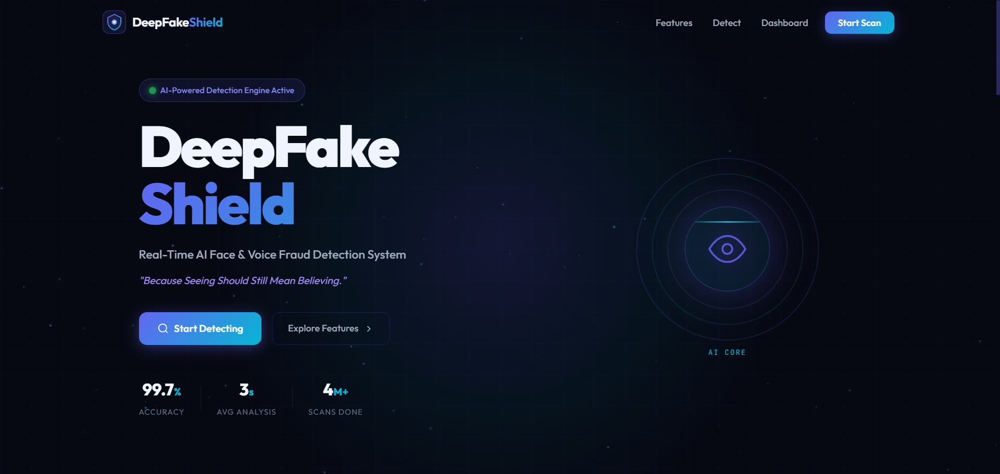
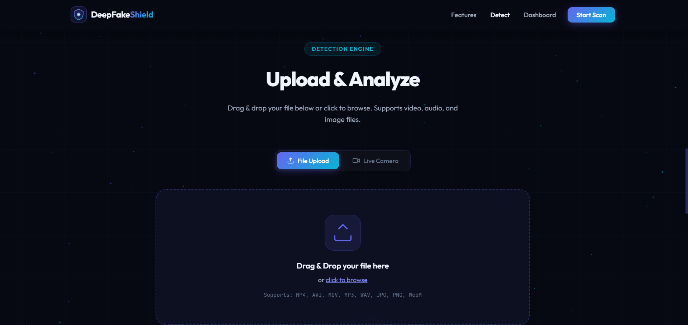
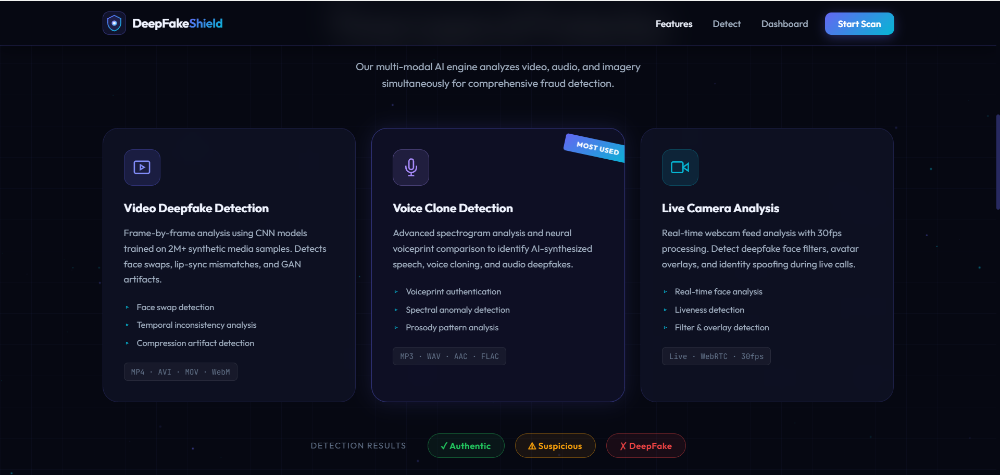
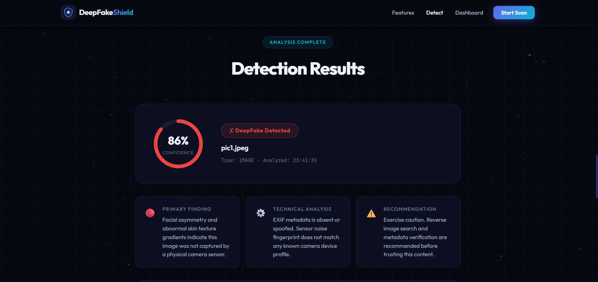
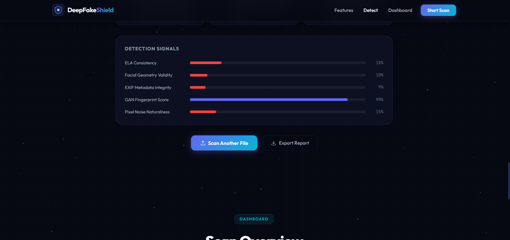
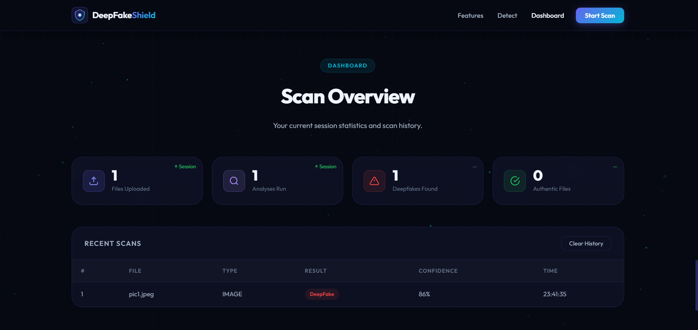

# 🛡️ Deepfake Detector Pro

An AI-powered web application that detects deepfake content in images, videos, and audio to ensure digital authenticity.

---

## 🚀 Features

- 🔍 Real-time deepfake detection
- 🧠 AI-powered analysis engine
- 📂 Upload images, videos, or audio files
- ⚡ Fast and responsive UI
- 📊 Detection results with confidence metrics
- 🎨 Modern and interactive frontend design

---

## 🛠️ Tech Stack

- **Frontend:** HTML, CSS, JavaScript
- **AI Integration:** (Mock AI / Future integration ready)
- **Deployment:** Vercel
- **Version Control:** GitHub

---
## 📸 Screenshots

### 🏠 Home Page

### 📤 Upload Section

### ⚙️ Detection Tool

### 📊 Result Page

### 📄 Detailed Analysis

### 🔍 Overview

## ▶️ How to Run Locally

1. Clone the repository:
git clone https://github.com/kappathasini/deepfake-detector-pro.git

2. Open the project folder

3. Run using Live Server OR open:
index.html
Markdowm
 [Open DeepFake Detector Pro](https://deepfake-detector-pro-mu.vercel.app)
